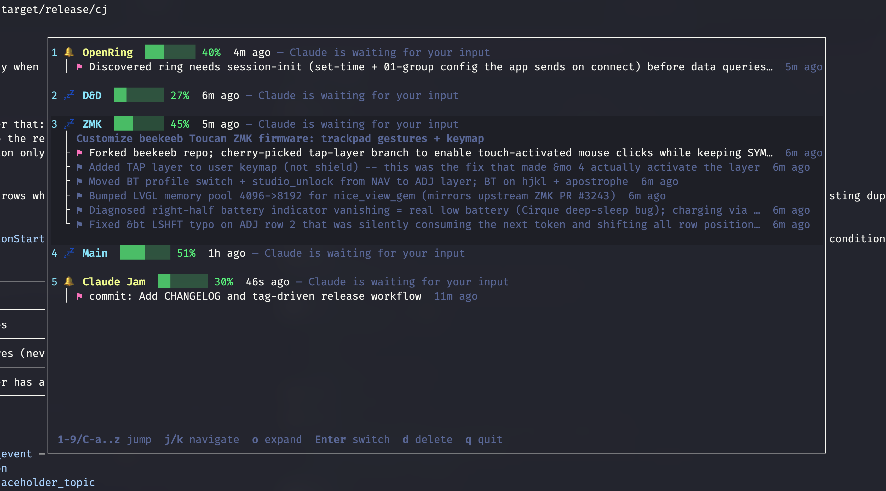
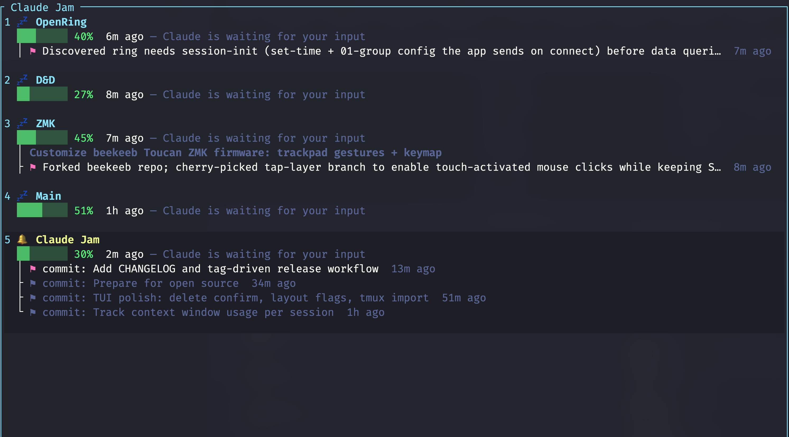

# Claude Jam

A fancy tmux window switcher and TUI dashboard for modern agentic workflows.

[](https://github.com/mightykho/claude-jam/actions/workflows/ci.yml)
[](LICENSE)

Claude Jam hooks into Claude Code's lifecycle events to track what each session is doing in real time — which tool it's running, whether it's waiting for input, how full its context window is, or whether it's done. Sessions appear in a compact list you can jump between with one keystroke.



## Install

### Homebrew (macOS / Linux)

```bash
brew tap mightykho/tap
brew install claude-jam
cj setup                     # one-time Claude Code wire-up
```

### From source

```bash
git clone https://github.com/mightykho/claude-jam && cd claude-jam
./install.sh
```

`install.sh` builds (or finds) the `cj` binary, drops it into `~/bin/cj`, then runs `cj setup` to wire Claude Code:

- Hook script at `~/.claude/hooks/claude-jam.sh`
- `cj hook` registered for every Claude Code lifecycle event in `~/.claude/settings.json`
- `Bash(cj:*)` added to allowed permissions so Claude can run `cj` commands without prompting
- Short instruction appended to `~/.claude/CLAUDE.md` so Claude knows to report topics and milestones

The Claude Code wiring lives inside the binary (`cj setup` / `cj teardown`), so every install channel finishes with the same `cj setup` step:

```bash
cargo install --git https://github.com/mightykho/claude-jam   # any host with Rust
cj setup

# or via prebuilt tarball from the latest release:
curl -L https://github.com/mightykho/claude-jam/releases/latest/download/cj-v0.1.4-aarch64-apple-darwin.tar.gz | tar xz
mv cj ~/bin/   # or anywhere on PATH
cj setup
```

`cj setup` is idempotent — safe to re-run after upgrades. `cj setup --check` reports the current wiring state without writing anything.

To uninstall, run `./uninstall.sh` (or `cj teardown && rm $(which cj)` if you installed via cargo/tarball). The SQLite database at `~/.claude/claude-jam.db` is preserved — delete it manually for a clean slate.

## Usage

```
cj                                       Launch TUI dashboard
cj -q                                    Launch TUI, quit after selecting a session
cj -b                                    Borderless mode (no title bar or border)
cj -v                                    Vertical mode (detail line below the title)
cj init [-s <tmux>] <topic>              Pre-register a session with a topic
cj topic [--session-id <id>] <text>      Set the topic for a session
cj milestone [--session-id <id>] <text>  Add a milestone to a session
cj context [--session-id <id>]           Print "used/total" context tokens
cj import                                Import all current tmux sessions
cj remove <tmux-session>                 Drop all sessions matching a tmux name
cj setup [--check]                       Wire cj into ~/.claude (hooks, permission, instruction)
cj teardown                              Reverse cj setup; the database is preserved
cj hook                                  Process a hook event from stdin (used internally)
cj -h                                    Show help
```

`-b -v` together give a chromeless stacked view that's ideal for narrow popups or tmux side-panels, with full milestone history expanded:



### TUI keybindings

| Key | Action |
|-----|--------|
| `j` / `k` | Navigate sessions |
| `1`–`9` | Jump to session by number |
| `Ctrl-a`..`Ctrl-z` | Jump to session by letter (after 9) |
| `Enter` | Switch to the session's tmux session |
| `o` | Expand/collapse milestone history |
| `d` | Delete session (Y/N confirmation popup) |
| `q` / `Esc` | Quit |

## How it works

Claude Code lets you register hooks for lifecycle events (`SessionStart`, `PreToolUse`, `PostToolUse`, `Notification`, `Stop`, etc.). When you install Claude Jam, it registers a single hook command — `cj hook` — for every event.

```
       ┌────────────────────┐
       │  Claude Code (×N)  │ — one per tmux pane / window
       └────────┬───────────┘
                │  hook events as JSON over stdin
                ▼
       ┌────────────────────┐
       │   cj hook          │ — short-lived process per event
       └────────┬───────────┘
                │  upsert + transcript parse
                ▼
       ┌────────────────────┐
       │ ~/.claude/         │
       │ claude-jam.db      │ — shared SQLite (WAL mode)
       └────────┬───────────┘
                │  reads, refreshes 1×/s
                ▼
       ┌────────────────────┐
       │   cj  (TUI)        │ — reader, never writes
       └────────────────────┘
```

Each event invocation does three things:

1. **Upserts the session row** — derives a status from the event name (`PreToolUse → working`, `Notification → waiting`, `Stop → idle`, `SessionEnd → offline`), extracts the most useful detail from the tool input (command for Bash, file_path for Read, pattern for Grep, fallback to the prompt or notification message), and writes it next to the tmux session name.
2. **Parses the transcript** — Claude Code passes the path to the session's JSONL transcript on every event. The hook reads it backwards to find the latest assistant message, sums `input + cache_creation + cache_read + output` tokens, and writes that to `context_used`. The `context_total` defaults to 200K and auto-bumps to 1M once observed usage exceeds 200K (this is the only reliable signal — the transcript doesn't expose the model's actual context window).
3. **Adopts placeholders** — if you ran `cj init <topic>` or `cj import` to seed a tmux session before its real Claude session appeared, the hook detects the matching `tmux:<name>` placeholder on the next event, migrates its topic and milestones onto the real session row, and deletes the placeholder. `open_db` also runs the same cleanup pass on every cj launch so stale placeholders from earlier sessions don't pile up.

The TUI is a strict reader: it polls the SQLite database once a second, never writes, and decorates the rows with status colors and a 8-cell context bar. When cj is launched from inside a tmux session that matches a row in the dashboard, that row also gets a cyan-bold left-edge bar (`▌`) running its full height so you can always tell at a glance which session you came from — separate from and independent of the cursor highlight. Pressing Enter shells out to `tmux switch-client -t <name>` so the keystroke takes you straight to the session's pane.

The schema is tiny — two tables (`sessions`, `milestones`) — and migrations are idempotent `ALTER TABLE ADD COLUMN` statements wrapped in `let _ =` so re-runs are no-ops. The database is local-only; no network calls anywhere in the project.

### Reporting topics and milestones

The installer adds an instruction to `~/.claude/CLAUDE.md` telling Claude to run:

- `cj topic "description"` when it understands the main goal of a session
- `cj milestone "what was accomplished"` after completing a significant step

These appear under the session in the dashboard. Topics render in bold, milestones with a `⚑` marker and a timestamp. Press `o` on a selected session to expand its full milestone history.

If you want to seed a session before Claude even starts (e.g. when opening a fresh tmux window), use `cj init` and the topic gets adopted automatically when Claude fires its `SessionStart` event:

```bash
tmux new-session -s my-feature
cj init "wire up the new billing endpoint"
claude  # SessionStart fires, topic moves onto the real session row
```

## tmux integration (optional)

Bind `cj` to a tmux key for quick access:

```tmux
# Prefix-w opens Claude Jam in a popup (auto-closes on selection)
bind w display-popup -E "cj -q"
```

Reload with `tmux source-file ~/.tmux.conf`. Now `<prefix> w` shows every active Claude session — pick one and tmux jumps straight to it.

You can also feed `cj context` into your tmux status line for a context-window indicator across all sessions.

## Development

```bash
# Pre-push gate — run all three (same as CI). Fix locally on any failure.
cargo fmt --all -- --check
cargo clippy --all-targets -- -D warnings
cargo test --release

# Dev install — symlink ~/bin/cj to the build output so
# `cargo build --release` alone refreshes the running binary
./install.sh --dev
```

The Rust toolchain is pinned in `rust-toolchain.toml` so local lints match what CI sees. Rustup will auto-fetch the pinned version on first invocation.

The crate is a lib + bin split. Pure, exit-free logic lives in `src/lib.rs` (re-exporting `db`, `hook`, `models`, `time`, `tmux`); the binary owns `commands` (CLI handlers that print / exit), `tui` (event loop, render, style), and `src/main.rs` itself, which is ~120 lines of arg parsing and dispatch.

```
src/
├── lib.rs            module declarations
├── main.rs           arg parsing + dispatch
├── models.rs         Session, Milestone, HookInput
├── time.rs           timestamp + relative-time helpers
├── tmux.rs           current/list/switch tmux session
├── db/
│   ├── mod.rs        schema, connection, queries
│   └── placeholder.rs adopt + cleanup
├── hook.rs           hook event processing + transcript parsing
├── commands.rs       cmd_* CLI handlers
└── tui/
    ├── mod.rs        App + run_tui event loop
    ├── render.rs     ui, render_delete_popup, centered_rect
    └── style.rs      bar, emojis, colors, truncation
tests/
└── integration.rs    cross-module flows against in-memory SQLite
```

The lib pulls in only `serde + rusqlite + serde_json` — `ratatui`/`crossterm` stay on the binary side so downstream consumers of the lib don't drag in UI deps. Database access uses bundled SQLite, so the only system dependency is `tmux` itself.

Tests are split three ways. Pure-function unit tests (`truncate_chars`, `format_context_bar`, `parse_timestamp`, `event_to_status`, `extract_detail`, `read_context_from_transcript`, `centered_rect`) live in `#[cfg(test)] mod tests` next to the code they cover. Cross-module DB integration tests (`process_hook_event`, `db_import_tmux_sessions`, `db_get_context`, `cleanup_orphan_placeholders`) live in `tests/integration.rs` and exercise real flows against an in-memory SQLite via `Connection::open_in_memory()`. CI runs `fmt --check`, `clippy -D warnings`, and `cargo test` on Linux and macOS.

## Contributing

PRs welcome. The bar to clear before opening one:

- `cargo fmt --all -- --check` is clean
- `cargo clippy --all-targets -- -D warnings` is clean
- `cargo test --release` passes
- New behavior has a test (the hook flow especially — it's the load-bearing piece)

Issues and feature requests are equally welcome — open one with a short reproduction or describe the use case.

## License

MIT — see [LICENSE](LICENSE).
